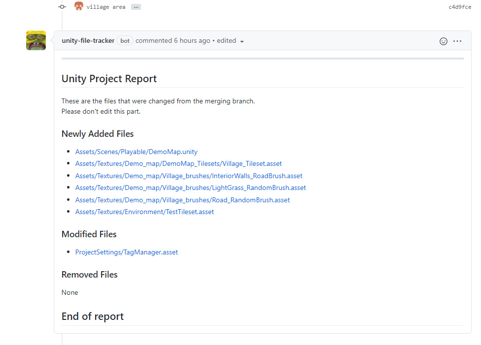

# Unity Push Checker

> A GitHub App that checks for important changes made to the Unity project without any noise.



## Setup

```sh
# install dependencies
yarn

# run the project in development mode
yarn dev

# build the project and run for production
yarn build
yarn start

# run unit tests
yarn test
```

Please create a new `.env` file with the following keys

```env
# The ID of your GitHub App
APP_ID=
WEBHOOK_SECRET=development

# Use `trace` to get verbose logging or `info` to show less
LOG_LEVEL=debug

# Go to https://smee.io/new set this to the URL that you are redirected to.
WEBHOOK_PROXY_URL=
```

## Contributing

If you have suggestions for how Unity Push Checker could be improved, or want to report a bug, open an issue! We'd love all and any contributions.

For more, check out the [Contributing Guide](CONTRIBUTING.md).

## License

[ISC](LICENSE) © 2020 Hoon Kim <hoonsubin@icloud.com>
