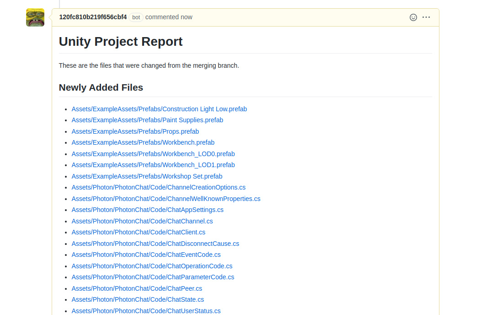

# Unity Push Checker

> A GitHub App that checks for important changes made to the Unity project without any noise.



## Setup

```sh
# Install dependencies
yarn

# Run with hot reload
yarn build:watch

# Compile and run
yarn build
yarn start
```

## Contributing

If you have suggestions for how Unity Push Checker could be improved, or want to report a bug, open an issue! We'd love all and any contributions.

For more, check out the [Contributing Guide](CONTRIBUTING.md).

## License

[ISC](LICENSE) © 2020 Hoon Kim <hoonsubin@icloud.com>
